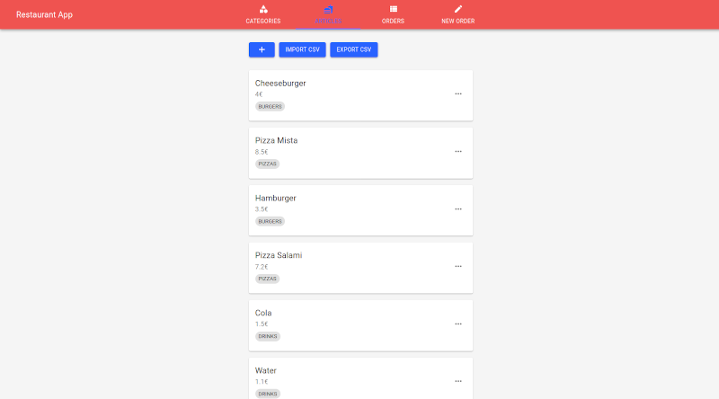

# restaurant-app

Example project for a fullstack restaurant application, containing a RESTful Node.js backend with MongoDB and a React frontend with Material-UI.



## Usage

You can launch all together using `docker-compose`.

Start:
```
$ docker-compose up &
```

Stop:
```
$ docker-compose rm -s -f -v
```

Initial data can be imported in UI's Article Tab from provided `Article.csv` file.
